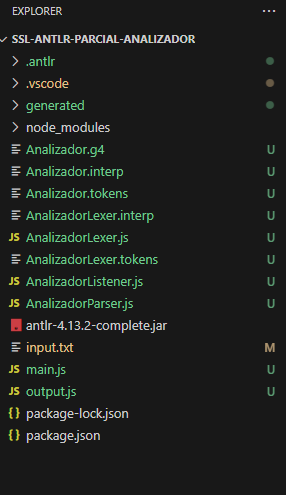
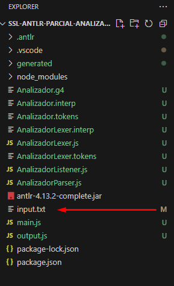
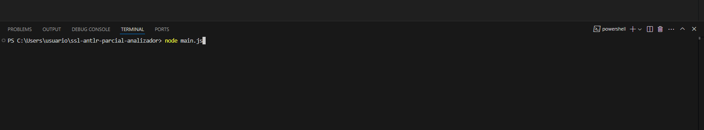

INSTALACIÓN
Para instalar este proyecto se debe clonar el repositorio ejecutando en una ventana de comandos (CMD, POWERSHELL o terminal en Linux) el siguiente comando:
git clone LINK

CÓMO UTILIZAR
1. Abrir la carpeta "ssl-antlr-parcial-analizador" en Visual Studio Code

2. Copiar el texto de alguno de los ejemplos "input-correcto" o "input-incorrecto" (O alternativamente escribir su propio input) y pegarlo dentro del archivo input.txt

3. Para ver el árbol de análisis sintáctico del input dado, presionar F5
4. Para realizar el análisis léxico, el análisis sintáctico, crear la tabla de tokens y convertir a código en JavaScript el input dado, escribir en la terminal de Visual Studio Code el siguiente comando: node main.js
